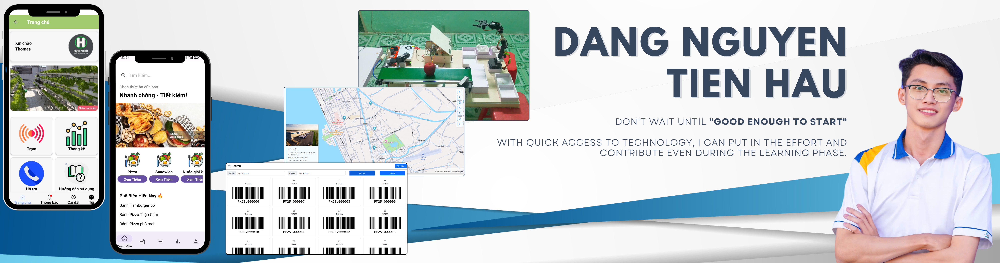
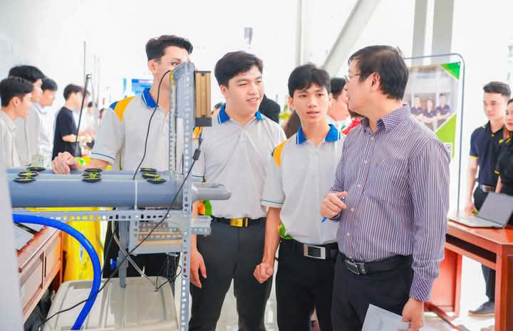

<!-- Banner hoặc ảnh cá nhân -->

  

## 🚀 About me

Xin chào! Mình là **Đặng Nguyễn Tiền Hậu**, một lập trình viên đam mê công nghệ với kinh nghiệm phát triển **Website**, Internet of Things và ứng dụng trên thiết bị di động.  
Mình khát khao được học hỏi, cọ xát với các dự án ở những cấp độ đa dạng để trở thành một **Fullstack Developer** chuyên nghiệp, mang lại các giải pháp công nghệ tối ưu và thân thiện cho xã hội.

  
  
  
  

---

## 🛠 Kỹ năng & Công nghệ

| **Ngôn ngữ lập trình**       | **Frontend**               | **Backend**      | **Database & Deploy** | **IoT & AI**                                  | **Other**                        |
|------------------------------|-----------------------------|------------------|-----------------------|-----------------------------------------------|-----------------------------------|
| JavaScript & TypeScript      | NextJS                      | ExpressJS        | MySQL                 | IoT system integration                        | Git/GitHub (Teamwork branches)    |
| Python                       | ReactJS                     | NestJS           | MongoDB               | Basic machine learning & computer vision      | Docker                            |
| Java                         | Tailwind CSS                |                  |                       |                                               |                                   |
| C++                          | Bootstrap 5                 |                  |                       |                                               |                                   |
|                              | Material UI                 |                  |                       |                                               |                                   |
|                              | Shadcn UI                   |                  |                       |                                               |                                   |

---

## 🚀 Một số dự án tiêu biểu

### 1. Smart Fruit Classification and Monitoring System (FruitsFlow)
<i>Graduation thesis | 03 - 06/2025</i>

**Mô tả:**  
Tech: NextJS, NestJS, TypeORM, Machine Learning (MobileNetV2), Computer Vision (OpenCV), SocketIO.  
Challenge: Need a website, IoT system and AI model to classify fruit by type and condition.  
Solution: Create model to classify fruits and use it in Raspberry Pi. Communicate the results via a management website with SocketIO.  
Result: Self-researched and successfully deployed machine learning model. Accurate classification system (90%), intuitive website, classification data updated in real time.  
Repository: https://github.com/HauDNT/QuanLyNVThuVien 

**Hình ảnh:**

  
  
  

---

### 2. Hyertech Mobile App (combined with Hytertech smart hydroponic system management)
<i>Startup project | 06 - 12/2024</i>

**Mô tả:**  
Tech: React Native, Laravel, Docker, Internet of Things.  
Challenge: Users need a mobile application to monitor vegetable status, environmental numbers measured from the Hydroponic.  
Solution: Create a mobile application that is intuitive, simple, complete and easy to use.  
Result:  
+ Can monitor environmental parameters, control devices on the rack (on/off), vegetable rack information and list of installed devices.  
+ **1st Prize – University Final Round 2024** praised for strong commercialization potential.  
Github: https://github.com/HauDNT/Hytertech-Mobile-Frontend

**Hình ảnh:**

  
  
  
  
  
  

---

### 3. Environmental monitoring system for bird's nest house
<i>Scientific Research Project | 06/2023 - 04/2024</i>

**Mô tả:**  
Technology: PHP, Pusher, C++, Internet of Things.  
Challenge: Users need a website and sensors (stations) to monitor environmental indicators in the birdhouse (Scope of topic: temperature & humidity).  
Solution: Create a measuring set including necessary sensors and an intuitive website to monitor, report statistics to users at many birdhouses.  
Results:  
+ Can monitor environmental parameters, control devices (on/off), information of one or more birdhouses on an online map and a list of installed devices.  
+ Report environmental condition parameters in real time. Send email alerts when conditions are abnormal.  
Github: https://github.com/HauDNT/QuanTracNhaYen

**Hình ảnh:**

  
  
  
  
  
  

---

### 4. Library Management System - Kien Giang Province Library
<i>Internship project | 06 - 12/2024</i>

**Mô tả:**  
Tech: ReactJS, ExpressJS, MySQL, Docker.  
Challenge: The existing library system lacked reporting features and had poor performance.  
Solution: Created the system with modern web stack and Dockerized it for deployment.  
Result: Improved search speed by ~40%, and reduced manual work for library staff.  
Github: https://github.com/HauDNT/QuanLyNVThuVien

**Hình ảnh:**

  
  
  
  

---

### 5. Rice Warehouse System with Interactive Map
<i>Persional project | 07 - 10/2024</i>

**Mô tả:**  
Tech: ReactJS, NestJS, MySQL (TypeORM), Docker, MapboxAPI.  
Challenge: Users had no visual overview of rice warehouses' locations and stock levels.  
Solution: Created modern website with integrated maps to visualize inventory management.  
Result: Quickly manage multiple granary branches on the map.  
Github: https://github.com/HauDNT/GIS-Project

**Hình ảnh:**

  
  
  
  

---

## 🏆 Thành tích
- Innovation & Entrepreneurship 2024 - 1st Prize (University Level)  
- Good Grade - Scientific Research Topic 2023 - 2024 [Swallow House Condition Monitoring System]  
- Good Grade - Scientific Research Topic 2023 - 2024 [Electronic Text Encryption Program Using 5 Popular Algorithms]  
